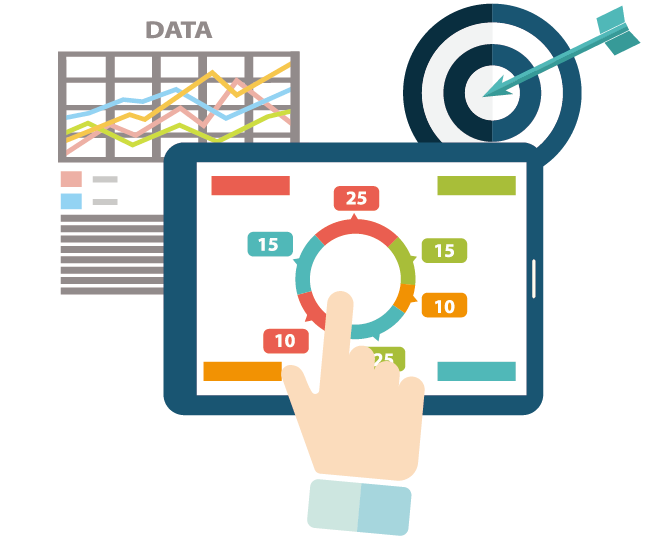

<!-- PROJECT LOGO -->
 

  

  <h3 align="center">Future Wealth</h3>

  

    An awesome finance habit tracker and analyzer!
     
    <a href="https://funding-project.herokuapp.com/"><strong>View the demo »</strong></a>
     

<!-- ABOUT THE PROJECT -->
## About The Project

[![Product Name Screen Shot][product-screenshot]](img/demo_main.png)

The project is aimed at helping individuals and small companies track expenses, make future budgeting plans with the assistance of technology. The users are able to add their previous expenses to the system. The system will analyze the user data and provide strategies and statistics that will help users make adjustments to their plans, correct their spending mistakes, and find opportunities to increase income.

### Built With
* Frontend: HTML, CSS, JavaScript, Bootstrap, jQuery.
* Backend: PHP, XAMPP(MYSQL/Apache).
* Additional: Heroku, Getwaves.io, CSS Gradient.

